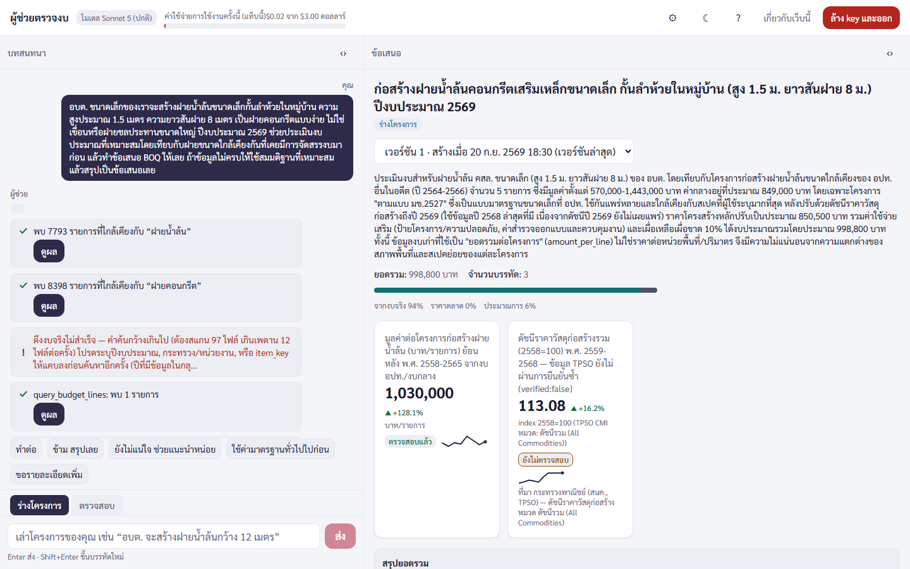
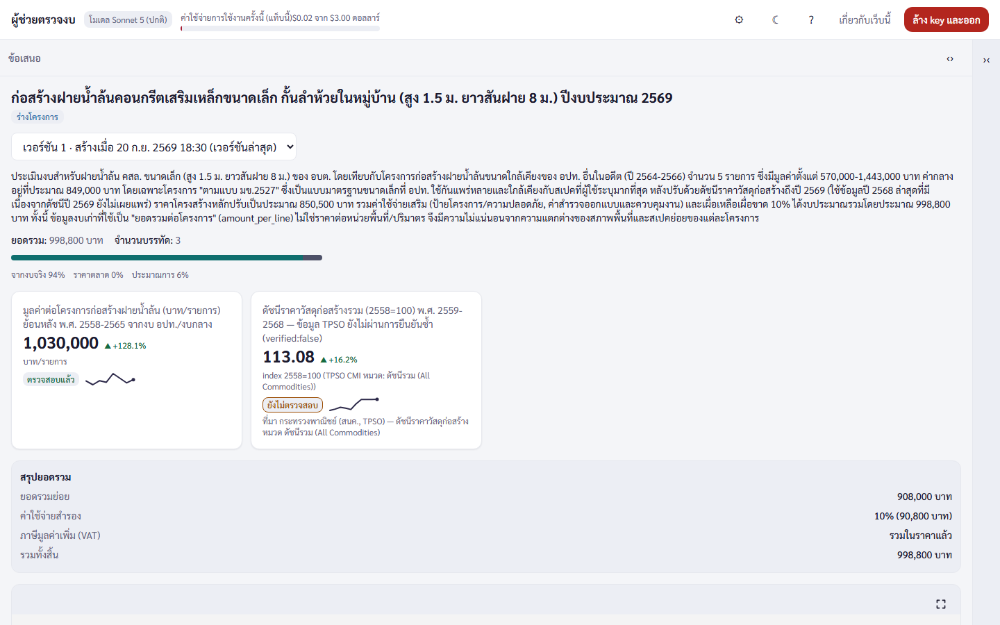
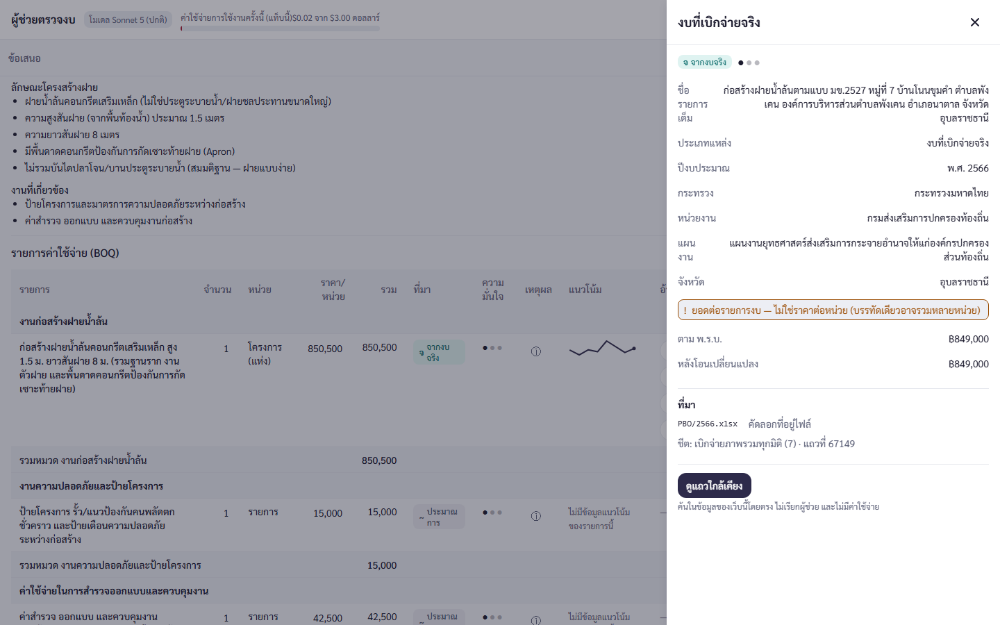
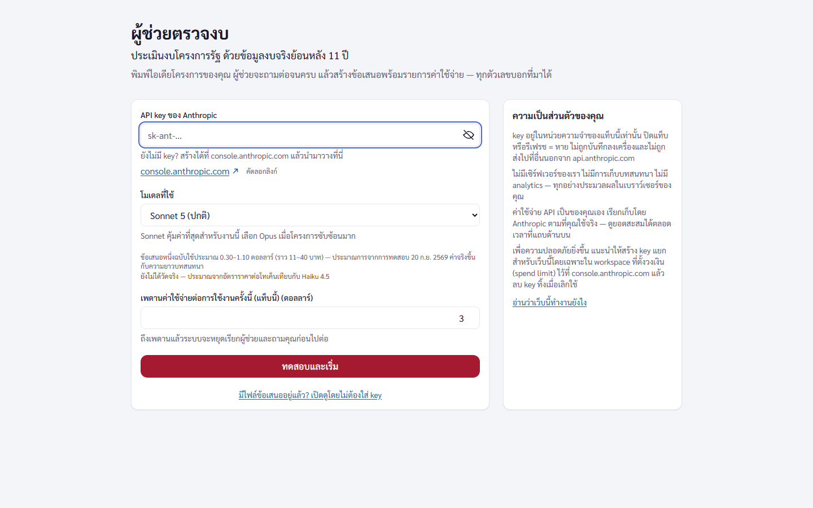

# ผู้ช่วยตรวจงบ — Thai Government Budget Planner (TGBP)

**เล่าโครงการเป็นภาษาไทย → ได้ข้อเสนอ + รายการค่าใช้จ่าย (BOQ) ที่ทุกตัวเลขกดดูที่มาได้ถึงระดับไฟล์ / ชีต / แถว**
อ้างอิง **งบประมาณจริงย้อนหลัง 11 ปี** (งบที่เบิกจ่ายจริงจาก PBO, ร่าง พ.ร.บ. งบประมาณ 2570, ข้อบัญญัติ อปท., เอกสาร กมธ.) — เป็นเว็บ static ล้วน ไม่มี backend ข้อมูลและ API key ของคุณไม่ออกจากเบราว์เซอร์

### ▶ ลองใช้เลย: **https://xzozero5.github.io/thai-government-budget-planner/**
ใช้ Anthropic API key ของคุณเอง (ข้อเสนอ 1 ฉบับราว 0.15–0.55 USD ด้วย Haiku — ตัวเลขวัดจริง) · เปิดไฟล์ข้อเสนอที่คนอื่นส่งมาได้ที่ `#/load` **โดยไม่ต้องมี key**



## ทำอะไรได้

| | |
|---|---|
| **ร่างงบจากข้อมูลจริง** — ผู้ช่วยค้นรายการงบที่ใกล้เคียง ปรับเงินเฟ้อด้วยดัชนีจริง แล้วสรุปเป็น BOQ พร้อมยอดรวม / ค่าเผื่อ / VAT |  |
| **ทุกตัวเลขมีที่มา** — แต่ละบรรทัดติดป้าย *จากงบจริง / ราคาตลาด / ประมาณการ* พร้อมระดับความมั่นใจ ตัวเลขที่ตรวจย้อนไม่ได้ระบบจะ **ลดความมั่นใจและเตือนเอง** ไม่ปล่อยผ่านเงียบ ๆ |  |
| **กดชิปอ้างอิง = เห็นแถวต้นทาง** — ชื่อรายการเต็ม หน่วยงาน ปีงบ ยอดตาม พ.ร.บ. / หลังโอนเปลี่ยนแปลง ไฟล์ / ชีต / เลขแถว และดูแถวใกล้เคียงได้โดยไม่เรียก AI |  |
| **โหมดตรวจสอบ** สำหรับผู้อนุมัติ — วางรายการงบที่ได้รับมา ให้ผู้ช่วยเทียบกับราคาที่เคยเบิกจ่ายจริงและชี้จุดที่ควรถาม | |
| **ส่งออก PDF ภาษาไทย** (ฝังฟอนต์สารบรรณ มีภาคผนวกแหล่งอ้างอิงและป้ายกำกับตัวเลขประมาณการ) และบันทึก `.tgbp.json` ไว้เปิดต่อ / ส่งให้คนอื่นตรวจ | |
| **ภาพประกอบเชิงแผนผัง** ที่ผู้ช่วยวาดเป็น SVG (ผ่านตัวกรองความปลอดภัยก่อนแสดงเสมอ) |  |

> ภาพทั้งหมดถ่ายจากแอปจริงกับข้อมูลจริง โดย **เล่นซ้ำ** ลำดับการเรียกเครื่องมือของการรันจริง 1 ครั้ง (เคสประเมิน “ฝายน้ำล้นขนาดเล็ก”, Claude Sonnet 5) ผ่าน mock ของ API — สร้างใหม่ได้ด้วย `npx playwright test -c playwright.screenshots.config.ts` ใน `web/` (ไม่เสียค่า API)

## ความเป็นส่วนตัวและความปลอดภัย
- **API key อยู่ในหน่วยความจำของแท็บเท่านั้น** — ไม่ลง localStorage / URL / log, ล้างอัตโนมัติเมื่อปิดแท็บหรือไม่ใช้งาน 60 นาที
- เบราว์เซอร์คุยกับ `api.anthropic.com` ปลายทางเดียว (บังคับด้วย CSP) — ไม่มี analytics, ไม่มี server ของเรา
- ไม่ใช้ OCR และไม่เดาตัวเลข: ข้อมูลที่ต้นทางไม่สมบูรณ์ติดธงคุณภาพให้เห็น · รายละเอียด: `docs/09-SECURITY.md`

<details>
<summary>หน้าแรก (ใส่ key)</summary>


</details>

**สถานะ:** MVP — Phase 0–5 เสร็จ, Phase 6 (QA / release) กำลังปิดงาน · ล่าสุดดูที่ [`docs/STATUS.md`](docs/STATUS.md) · สำหรับผู้พัฒนาเริ่มที่ `CLAUDE.md` แล้ว `docs/00-START-HERE.md`

## โครงสร้าง
- `CLAUDE.md` — กฎ, stack, conventions (อ่านก่อน)
- `docs/` — PRD, data inventory, pipeline spec, architecture, features/AI tools, UI spec, testing, QA, security, backlog, status
- `.claude/agents/` — subagents (po, architect, data-engineer, ai-engineer, ui-designer, frontend-dev, qa-engineer, security-reviewer, explorer)
- `.claude/commands/` — `/phase-0-bootstrap` … `/phase-6-qa`, `/status`, `/review`
- `เพราะ AI ไม่ใช่แค่ CHATBOT/` — ข้อมูลดิบ (read-only, ไม่ commit)
- `pipeline/` — Python ETL (offline, รันบนเครื่อง dev เท่านั้น) · `web/` — Vite React-TS app (static site)
- `.github/workflows/` — `ci.yml` (ทุก push/PR), `deploy.yml` (GitHub Pages หลัง ci ผ่านบน `main`)
- `.githooks/pre-commit` — บล็อก `sk-ant-…`, ไฟล์ > 24 MB, `.env*`

## Repository
`https://github.com/xzozero5/thai-government-budget-planner.git` (หรือ SSH `git@github.com:xzozero5/thai-government-budget-planner.git`) — โค้ด + public data (`web/public/data/`) อยู่ใน git; ข้อมูลดิบไม่อยู่ (ดู CLAUDE.md §5.1)

## Deploy
GitHub Actions → GitHub Pages: `https://xzozero5.github.io/thai-government-budget-planner/` (push `main` แล้ว deploy อัตโนมัติ; ครั้งแรกต้องตั้ง Settings → Pages → Source = GitHub Actions)

## Build / Run
หลัง clone ครั้งแรก:
```bash
git config core.hooksPath .githooks
```
Web (Node 22+):
```bash
cd web && npm ci
npm run dev                          # http://localhost:5173/thai-government-budget-planner/
npm run lint && npm run typecheck && npm run test && npm run build
npx playwright install chromium      # ครั้งแรก
npm run test:e2e
```
Pipeline (Python 3.11+, [uv](https://docs.astral.sh/uv/)) — ถ้า `uv` ไม่อยู่ใน PATH: `python -m pip install --user uv` แล้วใช้ `python -m uv` แทน `uv`; บน Windows ตั้ง `PYTHONUTF8=1` ก่อนรันคำสั่งที่พิมพ์ภาษาไทย:
```bash
cd pipeline && uv sync
uv run tgbp --help
uv run ruff check . && uv run ruff format --check . && uv run pytest
```
ข้อมูลดิบ (`เพราะ AI ไม่ใช่แค่ CHATBOT/`) ต้องวางที่ root ของ repo เอง — ไม่อยู่ใน git; pipeline อ่านอย่างเดียว เขียน output ไป `web/public/data/`

### สร้างข้อมูลใหม่ (regenerate data)
```bash
cd pipeline
uv run tgbp build --dataset all      # ~12 นาที, deterministic: extract → normalize → validate (V1–V9) → publish
                                     # → web/public/data/ (manifest, shards, catalog, trends, docs, econ, ดัชนีค้นหา)
                                     # hard validation fail = exit code ≠ 0 และไม่ publish
uv run tgbp validate                 # รันเฉพาะ validation ซ้ำ → validation.json
```
ตรวจ `git diff --stat web/public/data` แล้ว commit เป็น commit แยก (`data: …`) — `data_version` ใน `manifest.json` จะเปลี่ยนเมื่อเนื้อหา shard เปลี่ยน

### Eval ของ AI (ใช้เงินจริง — อ่าน `docs/api-budget.md` ก่อน)
```bash
cd web
npm run eval                         # dry-run (fake client, ไม่เสียเงิน)
npm run eval -- --real --confirm-spend --tier core8 --max-usd 1.80   # ยิง API จริง: key จาก web/.env.local, ledger ที่ tests/eval/api-spend.json
npm run guard:n2                     # ยืนยันว่า key ของ eval ไม่ถูก inline เข้า bundle
```

### ใช้งานเว็บ
เปิด `https://xzozero5.github.io/thai-government-budget-planner/` → ใส่ API key ของ Anthropic (อยู่ในหน่วยความจำของแท็บเท่านั้น) → เล่าโครงการ → ได้ข้อเสนอ + BOQ ที่ทุกตัวเลขคลิกดูที่มาได้ → ส่งออก PDF หรือบันทึก `.tgbp.json` (เปิดดูภายหลังที่ `#/load` ได้โดยไม่ต้องใช้ key) — ข้อจำกัดของข้อมูลดูที่หน้า "เกี่ยวกับเว็บนี้"
**หมายเหตุ**: ทุกครั้งที่ deploy เวอร์ชันใหม่ แท็บที่เปิดค้างไว้ควรบันทึกงานแล้วรีเฟรช (ไฟล์ JS ของเวอร์ชันเดิมถูกแทนที่)

## เริ่มต้น (Claude Code)
```
claude
> /phase-0-bootstrap    # จะทำ T-000 (git init + remote + push แผน) ก่อน
```
แล้วไล่ `/phase-1-data` → `/phase-6-qa` ตาม `docs/00-START-HERE.md` (`/status` เพื่อดูว่าอยู่ตรงไหน)

## สิ่งที่ต้องเตรียมเอง
- Python 3.11+ และ [uv](https://docs.astral.sh/uv/) (หรือ pip), Node 22+, poppler (`pdftotext`, `pdfinfo`), LibreOffice (แปลง .xls เก่า)
- Anthropic API key สำหรับรัน eval (ใส่ใน `web/.env.local` ห้าม commit)
